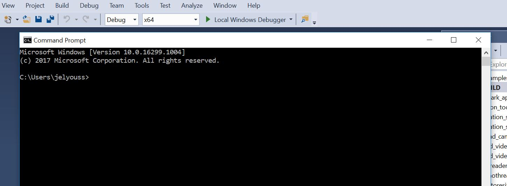

  
# Intel® OpenVINO™ Toolkit (Windows)
In this tutorial you will build and run some of samples applications which come with the Intel® OpenVINO™ Toolkit and an Intel® pretrained model. Once completed you will have an understanding of the code required to start creating your own OpenVINO™ based solutions and how to target various accelerators in the Intel® portfolio (CPU, GPU, VPU).

## System Requirements
* Operating Systems

	* Microsoft Windows* 10 64-bit

## Prerequisites
* [Install Intel® Distribution of OpenVINO™ toolkit for Windows* 10](https://software.intel.com/en-us/articles/OpenVINO-Install-Windows)

# Building the Sample Applications on Windows* OS

The sample applications are provided as a CMake project so the first step is to use a CMake generator to generate our Visual Studio Solution so we can use the Visual Studio IDE for developing and debugging the code.

Follow these steps to prepare your Windows computer for the samples:

- Go to the **"C:\Intel\computer_vision_sdk\deployment_tools\inference_engine\samples\"** directory.

- Double-click **"create_msvc\<version\>_solution.bat"**, where <version> is 2015 or 2017 to match your Visual Studio version. For example, for Microsoft Visual Stuio 2017: **create_msvc2017_solution.bat**. This file generates Microsoft Visual Studio solution.

- **Double-click** the **"C:\Users\\<username\>\Documents\Intel\OpenVINO\inference_engine_samples_\<version\>\Samples.sln"** file which you just generated , where <version> is 2015 or 2017 depending on your Visual Studio version.

- Build the solution: **Build->Build Solution**

- Make sure the application built successfully by checking the **Output** log in the bottom left pane.

- The sample application binaries are in the **"C:\Users\<username>\Documents\Intel\OpenVINO"** directory.

## Running the Samples

### Image Classification Sample
#### Description

This topic demonstrates how to run the Image Classification sample application, which does inference using image classification networks like AlexNet* and GoogLeNet*.

#### How It Works

Upon the start-up, the sample application reads command-line parameters and loads a network and an image to the Inference Engine plugin. When inference is done, the application creates an output image and outputs data to the standard output stream.

#### Set the enviromenent variables

- Open a command prompt (cmd) and execute the following instruction

```console
c:\Intel\computer_vision_sdk\bin\setupvars.bat

```




#### Downloading and Optimizing the model (squeezenet)

```console
c:\Intel\computer_vision_sdk\deployment_tools\model_downloader\downloader.py --name squeezenet1.1 --output_dir  models

c:\Intel\computer_vision_sdk\deployment_tools\model_optimizer\mo.py --input_model models\classification\squeezenet\1.1\caffe\squeezenet1.1.caffemodel --output_dir models\ir\FP32
```
#### Adding the label file
```console
copy c:\Intel\computer_vision_sdk\deployment_tools\demo\squeezenet1.1.labels .\models\ir\FP32\
```

#### Running

##### CPU
```console
.\Documents\Intel\OpenVINO\inference_engine_samples_2017\intel64\Debug\classification_sample.exe -i c:\Intel\computer_vision_sdk\deployment_tools\demo\car.png -m .\models\ir\FP32\squeezenet1.1.xml
```
##### GPU
```console
.\Documents\Intel\OpenVINO\inference_engine_samples_2017\intel64\Debug\classification_sample.exe -i c:\Intel\computer_vision_sdk\deployment_tools\demo\car.png -m .\models\ir\FP32\squeezenet1.1.xml -d GPU
```

### Object Detection SSD Demo / Async API 

#### Description
This demonstration showcases Object Detection with SSD and new Async API. Async API usage can improve overall frame-rate of the application, because rather than wait for inference to complete, the app can continue doing things on the host, while accelerator is busy. Specifically, this demonstration keeps two parallel infer requests and while the current is processed, the input frame for the next is being captured. This essentially hides the latency of capturing, so that the overall framerate is rather determined by the MAXIMUM(detection time, input capturing time) and not the SUM(detection time, input capturing time)

Other demonstration objectives:

- Video as input support via OpenCV*
- Visualization of the resulting bounding boxes and text labels (from the .labels file) or class number (if no file is provided)
- OpenCV* provides resulting bounding boxes, labels, and other information. You can copy and paste this code without pulling Inference Engine samples helpers into your application.
-Demonstrate the Async API in action. For this, the demonstration features two modes with a Tab key toggle.
--Old-style "Sync" way - The frame capturing with OpenCV* executes back-to-back with Detection
--"Truly Async" way - The Detection is performed on the current frame, while the OpenCV* captures the next frame.

#### Set the enviromenent variables

- Open a command prompt (cmd) and execute the following instruction
```console
    c:\Intel\computer_vision_sdk\bin\setupvars.bat

```

#### Downloading and Optimizing the model (mobilenet-ssd)

```console
c:\Intel\computer_vision_sdk\deployment_tools\model_downloader\downloader.py --name mobilenet-ssd --output_dir  models

c:\Intel\computer_vision_sdk\deployment_tools\model_optimizer\mo.py --scale 256 --mean_values [127,127,127] --input_model models\object_detection\common\mobilenet-ssd\caffe\mobilenet-ssd.caffemodel --data_type FP32 --output_dir models\ir\FP32

c:\Intel\computer_vision_sdk\deployment_tools\model_optimizer\mo.py --scale 256 --mean_values [127,127,127] --input_model models\object_detection\common\mobilenet-ssd\caffe\mobilenet-ssd.caffemodel --data_type FP16 --output_dir models\ir\FP16
```
#### Adding the label file
- Copy the following lines into **"C:\Users\\<username\>\models\ir\FP32\mobilenet-ssd.labels"** file
```console
background
aeroplane
bicycle
bird
boat
bottle
bus
car
cat
chair
cow
diningtable
dog
horse
motorbike
person
pottedplant
sheep
sofa
train
tvmonitor  
```
- Then
```console
copy .\models\ir\FP32\mobilenet-ssd.labels .\models\ir\FP16\mobilenet-ssd.labels
```
#### Running
** You can use 'Tab' to switch between the synchronized execution and the true Async mode.**

##### CPU
```console
.\Documents\Intel\OpenVINO\inference_engine_samples_2017\intel64\Debug\object_detection_demo_ssd_async.exe -i cam -m .\models\ir\FP32\mobilenet-ssd.xml -d CPU
```
##### MOVIDIUS
```console
.\Documents\Intel\OpenVINO\inference_engine_samples_2017\intel64\Debug\object_detection_demo_ssd_async.exe -i cam -m .\models\ir\FP16\mobilenet-ssd.xml -d MYRIAD
```
##### Demo Output
The output uses OpenCV* to display the resulting frame with detections rendered as bounding boxes and labels, if provided. In default mode, the demo reports:

- OpenCV* time: Frame decoding + time to render the bounding boxes, labels, and display of the results.
- Detection time: Inference time for the objection network. This is reported in the Sync mode.
- Wallclock time: The combined application-level performance.

### Interactive Face Detection Demo
#### Description
This demo showcases Object Detection task applied for face recognition using sequence of neural networks. Async API can improve overall frame-rate of the application, because rather than wait for inference to complete, the application can continue operating on the host while accelerator is busy. This demo executes four parallel infer requests for the Age/Gender Recognition, Head Pose Estimation, Emotions Recognition, and Facial Landmarks Detection networks that run simultaneously. The corresponding pre-trained models are delivered with the product:

- face-detection-adas-0001, which is a primary detection network for finding faces
- age-gender-recognition-retail-0013, which is executed on top of the results of the first model and reports estimated age and gender for each detected face
- head-pose-estimation-adas-0001, which is executed on top of the results of the first model and reports estimated head pose in Tait-Bryan angles
- emotions-recognition-retail-0003, which is executed on top of the results of the first model and reports an emotion for each detected face
- facial-landmarks-35-adas-0001, which is executed on top of the results of the first model and reports normed coordinates of estimated facial landmarks

Other demo objectives are:

- Video as input support via OpenCV*
- Visualization of the resulting face bounding boxes from Face Detection network
- Visualization of age/gender, head pose, emotion information, and facial landmarks positions for each detected face
- OpenCV is used to draw resulting bounding boxes, labels, and other information. You can copy and paste this code without pulling Inference Engine demo helpers into your application.

#### How It Works
The application reads command-line parameters and loads up to five networks depending on -m... options family to the Inference Engine.
The application gets a frame from the OpenCV VideoCapture.
The application performs inference on the Face Detection network.
The application performs four simultaneous inferences, using the Age/Gender Recognition, Head Pose Estimation, Emotions Recognition, and Facial Landmarks Estimation networks if those are specified in command line.
The application displays the results.
The new Async API operates with a new notion of the Infer Request that encapsulates the inputs/outputs and separates scheduling and waiting for result. For more information about Async API and the difference between Sync and Async modes performance, refer to How it Works and Async API sections in Object Detection SSD, Async API Performance Showcase Demo.

#### Set the enviromenent variables
- Open a command prompt (cmd) and execute the following instruction

```console
    c:\Intel\computer_vision_sdk\bin\setupvars.bat
```
#### Running
```console
.\Documents\Intel\OpenVINO\inference_engine_samples_2017\intel64\Debug\interactive_face_detection_demo.exe -i cam  -m c:\Intel\computer_vision_sdk\deployment_tools\intel_models\face-detection-adas-0001\FP32\face-detection-adas-0001.xml -m_ag c:\Intel\computer_vision_sdk\deployment_tools\intel_models\age-gender-recognition-retail-0013\FP16\age-gender-recognition-retail-0013.xml -m_em c:\Intel\computer_vision_sdk\deployment_tools\intel_models\emotions-recognition-retail-0003\FP16\emotions-recognition-retail-0003.xml -d_ag MYRIAD -d_em GPU
```

A number of Inference Engine samples are included with OpenVINO™ which allow you to explore it's capabilities using pretrained models. The sample executables can be found in the following directory:

> Documents\Intel\OpenVINO\inference_engine_samples_2015\intel64\Release

You can find additional information about the samples with examples of how to use them [HERE](https://software.intel.com/en-us/articles/OpenVINO-IE-Samples).

## Additional Resources
[Intel® OpenVINO™ Toolkit](https://software.intel.com/en-us/openvino-toolkit)

[Inference Engine Developer Guide](https://software.intel.com/en-us/articles/OpenVINO-InferEngine)

[Pretrained Models](https://software.intel.com/en-us/openvino-toolkit/documentation/pretrained-models)


